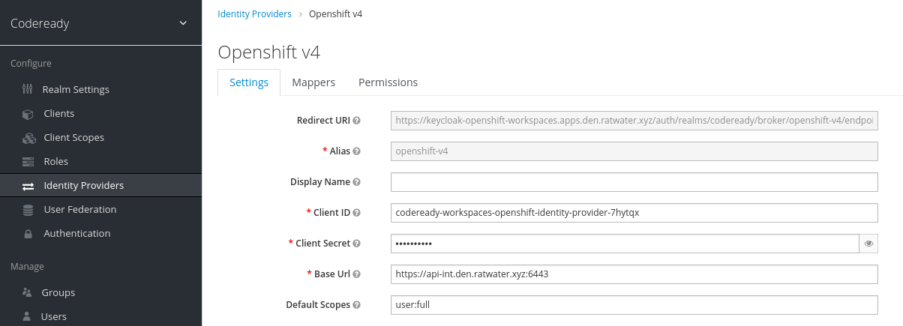
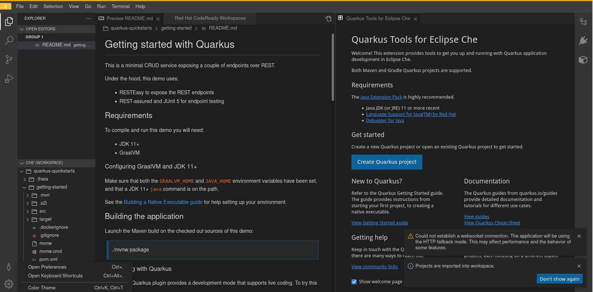

= Code Ready Workspaces:  Multi-User Access to same Workspace

This tutorial provides instructions on how a CodeReady Workspace (CRW) user can provide a different user with access to their workspace.

:numbered:

== Reference

. https://gist.github.com/andykrohg/78677d90a5183091be0b96c6a3a3b882
. link:https://access.redhat.com/documentation/en-us/red_hat_codeready_workspaces/2.15/html-single/administration_guide/index#authorizing-users_crw[CRW Admin Guide:  Authorizing Users]

== Pre-reqs

.  `cluster-admin` access to OpenShift cluster
.  OpenShift cluster should be provisioned with several non cluster-admin users.
+
This tutorial assumes OCP users with names of the following convention:  user[1-100]

. CodeReady Workspaces installed via operator
+
This tutorial has been tested using CodeReady Workspaces v2.15 on OCP 4.9

. `cheCluster` custom resource installed in _openshift-workspaces_ namespace

. Keycloak for CRW is enabled with an _IdentityProvider_ called _openshift-v4_ that federates SSO to the OCP OAuth provider:
+

. _user1_ has authenticated into CRW and created a workspace (of any type)

. `oc` utility installed locally
. `jq` utility installed locally
. `curl` utility installed locally

== Procedure

Scenario:  _user1_ is a CRW user that has previously created a CRW workspace.
_user1_ will share his/her workspace with _user3_.

. Authenticate into OpenShift at the command line as a _cluster-admin_ user. 

. Set shell environment variables:
+
-----
RHSSO_URL=https://$(oc get route keycloak -n openshift-workspaces --template='{{ .spec.host }}')
REALM_ID=codeready
REALM_CONSOLE_URL="$RHSSO_URL/auth/admin/$REALM_ID/console"
CRW_WORKSPACE_OWNER_TOKEN_URL="$RHSSO_URL/auth/realms/$REALM_ID/protocol/openid-connect/token"
CRW_WORKSPACE_OWNER=user1
CRW_WORKSPACE_OWNER_PASSWD="change me !!!!!!!"
CRW_URL=https://$(oc get route codeready -n openshift-workspaces --template='{{ .spec.host }}')
CRW_SWAGGER_URL=$CRW_URL/swagger
-----

. In the same shell, switch to CRW workspace owner (user1):
+
-----
$ oc login -u user1 -p $CRW_WORKSPACE_OWNER_PASSWD
-----

. Grab OpenShift token corresponding to user1:
+
-----
$ OCP_TOKEN=$(oc whoami -t)
-----

. Swap OCP Token for CRW Token:
+
-----
$ CRW_WORKSPACE_OWNER_TKN=$(curl -X POST -s \
            -d "client_id=codeready-public" \
            --data-urlencode "grant_type=urn:ietf:params:oauth:grant-type:token-exchange" \
            -d "subject_token=$OCP_TOKEN" \
            -d "subject_issuer=openshift-v4" \
            --data-urlencode "subject_token_type=urn:ietf:params:oauth:token-type:access_token" \
            $RHSSO_URL/auth/realms/$REALM_ID/protocol/openid-connect/token \
            | sed 's/.*access_token":"//g' | sed 's/".*//g')
-----

. Using CRW token, identify ID of user1's workspace:
+
-----
$ CRW_WORKSPACE_ID=$(curl -X GET \
  -H "Authorization: Bearer $CRW_WORKSPACE_OWNER_TKN" \
  -H "accept: application/json" \
  "$CRW_URL/api/workspace" \
  | jq -r '.[0].id'
)
-----

. Optional:  Using CRW token, review all CRW permissions assigned to this owner for this workspace:
+
-----
$ curl -X GET \
  -H "Authorization: Bearer $CRW_WORKSPACE_OWNER_TKN" \
  -H "accept: application/json" \
  "$CRW_URL/api/permissions/workspace/all?instance=$CRW_WORKSPACE_ID"
  | jq .
-----

. Set additional environment variables pertaining to target user that is to be given permission's to user1's workspace:
+
-----
TARGET_CRW_WORKSPACE_OWNER_NAME=user3
TARGET_CRW_WORKSPACE_OWNER_ID=$(curl -s -H "Authorization: Bearer ${CRW_WORKSPACE_OWNER_TKN}" "${CRW_URL}/api/user/find?name=${TARGET_CRW_WORKSPACE_OWNER_NAME}" | jq -r .id)
-----

. Provide permissions to workspace:
+
-----
$ curl -v -X POST \
  -H "Authorization: Bearer $CRW_WORKSPACE_OWNER_TKN" \
  -H 'Content-Type: application/json' \
  -H "accept: text/html" \
  -d '{
  "actions": [
    "read",
    "use",
    "run"
  ],
  "userId": "'$TARGET_CRW_WORKSPACE_OWNER_ID'",
  "domainId": "workspace",
  "instanceId": "'$CRW_WORKSPACE_ID'"
}' \
  "$CRW_URL/api/permissions"
-----

. As target user (_user3_), navigate to _user1's_ workspace and authenticate in.
+

